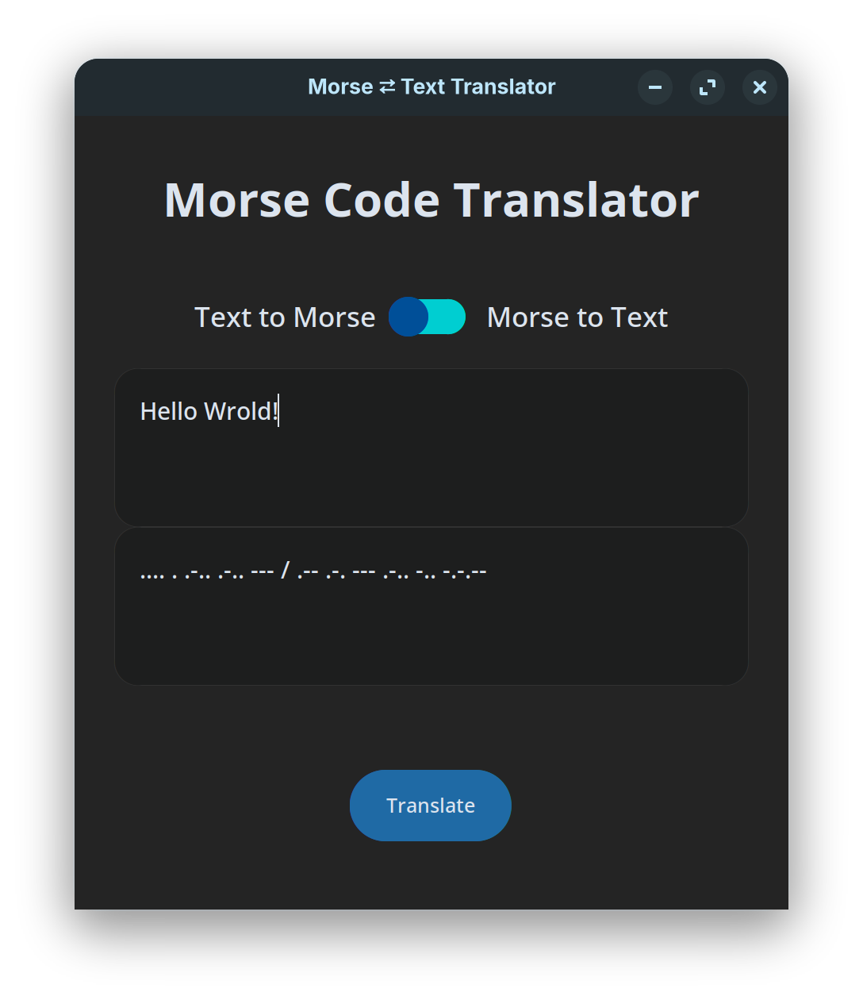
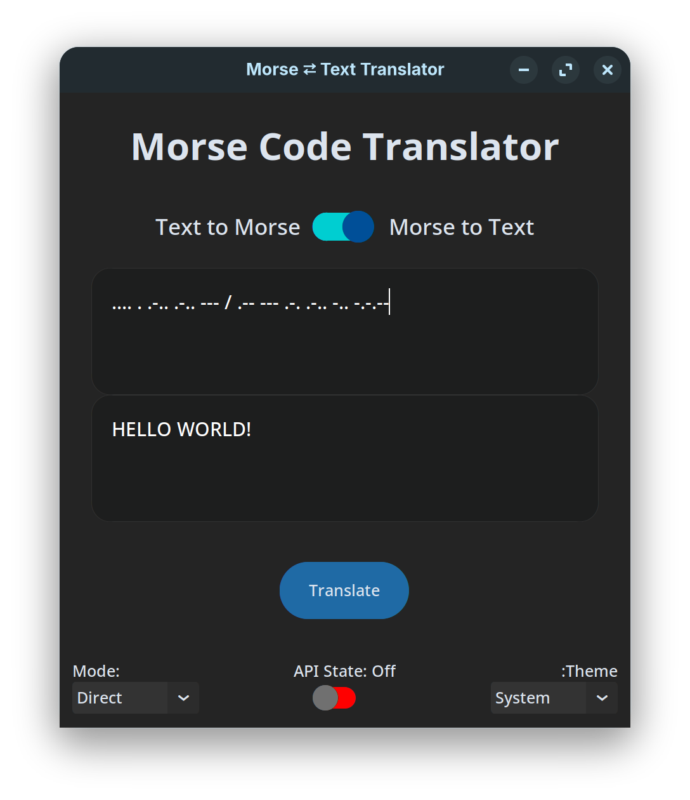
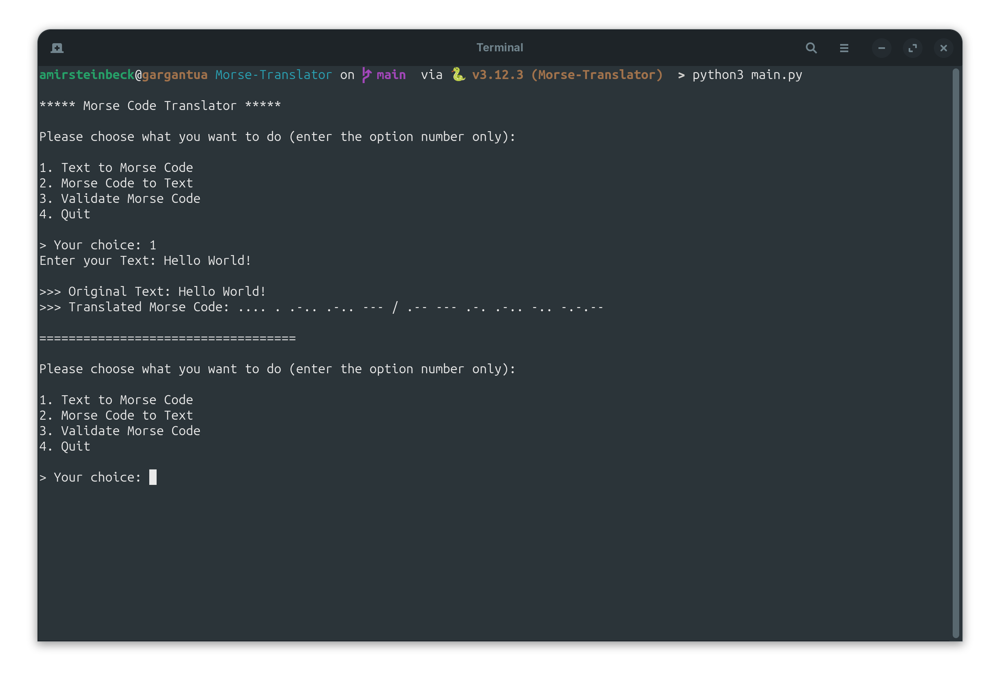
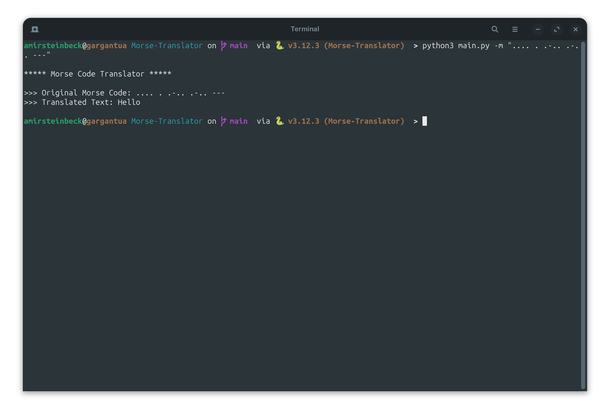
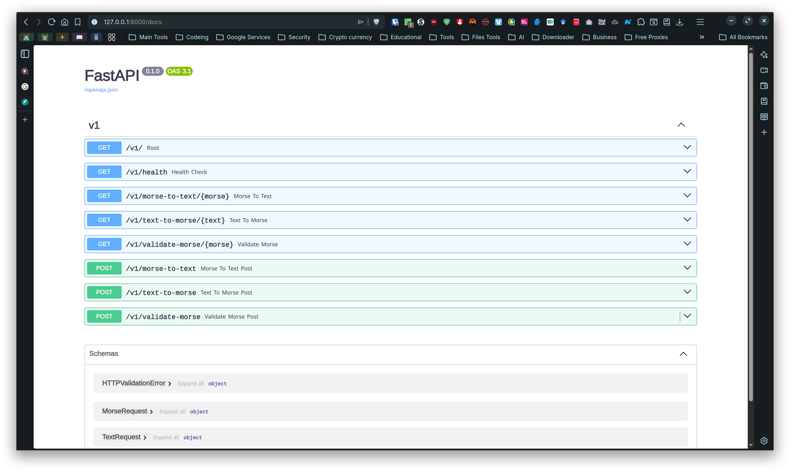

# Morse-Translator

[](https://www.python.org/downloads/)
[](LICENSE)
[](https://fastapi.tiangolo.com/)
[](https://pypi.org/project/amirstein-morse-translator/)


- [English Version of the Doc](../README.md)
- [نسخه فارسی سند](../docs/README.fa.md)
- [النسخة العربية من المستند](../docs/README.ar.md)

Un traducteur Code Morse ⇄ Texte compact et riche en fonctionnalités avec CLI, GUI et API REST. Conversions bidirectionnelles pour lettres, chiffres et ponctuation courante avec validation intégrée.

---

## 📸 Captures d’écran

<div style="
  display:flex;
  gap:12px;
  overflow-x:auto;
  padding:12px 0;
  flex-wrap:nowrap;
">
  
  
  
  
  
</div>

---

## 🚀 Fonctionnalités

- **Texte ↔ Morse** : conversion bidirectionnelle pour A–Z, 0–9 et la ponctuation courante  
- **Validation** : vérifie la syntaxe Morse (autorisés : `.`, `-`, `/`, espace ; max 6 caractères par jeton)  
- **CLI interactive** : expérience pilotée par menu via `main.py`  
- **GUI Desktop** : interface basée sur `customtkinter` réactive avec champs texte/Morse et interrupteur  
- **API REST** : FastAPI avec routes versionnées (`/v1`) et documentation interactive à `/docs`  
- **Package installable** : commande globale `morse` après `pip install -e .`  
- **Drapeaux CLI** : conversions en un seul coup (`-t`, `-m`, `-vm`, `-ui`)  

---

## 📦 Installation

1. **Cloner et créer un environnement virtuel :**

```bash
git clone https://github.com/amirhossein77-98/Morse-Translator.git
cd Morse-Translator
python3 -m venv .venv
source .venv/bin/activate  # Sur Windows : .venv\Scripts\activate
```

2. **Installer les dépendances :**

```bash
pip install -e .
```

Installe le projet en mode développement avec le point d’entrée CLI global `morse`.

**Environnements alternatifs :**
- **pipenv :** `pipenv install --dev && pipenv shell`
- **poetry :** `poetry install && poetry shell`
- **uv :** `uv sync` (si initialisé avec uv)

---

## 🖥 Utilisation

### Exécution directe

**Menu interactif :**
```bash
python3 main.py
```

### Arguments CLI

Tous les drapeaux sont mutuellement exclusifs. Utilisez ` / ` (espace-slash-espace) pour séparer les mots en Morse.

**Texte vers Morse :**
```bash
python3 main.py -t "Hello World"
morse -t "Hello World"  # Après pip install -e .
```

**Morse vers Texte :**
```bash
python3 main.py -m ".... . .-.. .-.. --- / .-- --- .-. .-.. -.."
```

**Valider le Morse :**
```bash
python3 main.py -vm ".... . .-.. .-.. ---"
```

### GUI

Lancer la GUI réactive `customtkinter` :

```bash
python3 main.py -ui
morse -ui  # Après pip install -e .
```

**Fonctionnalités :**
- Basculer entre « Texte vers Morse » et « Morse vers Texte » via un interrupteur  
- Zones de texte entrée/sortie en temps réel  
- Validation de l’entrée Morse  
- Grille réactive, widgets centrés  

### API

Démarrer le serveur FastAPI :

```bash
uvicorn api.app:app --reload
```

Ouvrez `http://127.0.0.1:8000/docs` pour la documentation API interactive.

**Exemples de points de terminaison** (base : `/v1`) :

```bash
# GET
curl "http://127.0.0.1:8000/v1/text-to-morse/hello"
curl "http://127.0.0.1:8000/v1/morse-to-text/--"
curl "http://127.0.0.1:8000/v1/validate-morse/--"

# POST
curl -X POST "http://127.0.0.1:8000/v1/text-to-morse" \
  -H "Content-Type: application/json" \
  -d '{"text":"hello"}'
```

Format de réponse :
```json
{
  "original_text": "hello",
  "translated_text": ".... . .-.. .-.. ---"
}
```

### Package installable `morse`

Après `pip install -e .`, utilisez la commande globale `morse` :

```bash
morse -t "Hello"
morse -m ".... . .-.. .-.. ---"
morse -vm "..."
morse -ui
```

---

## 🔧 Tests

Exécuter les tests unitaires et API (pas besoin de démarrer le serveur) :

```bash
python3 -m unittest discover -v        # Tous les tests
python3 -m unittest test.api_tests     # API uniquement
python3 -m unittest test.converter_tests  # Convertisseur uniquement
```

**Remarque :** Les tests utilisent `unittest` et FastAPI `TestClient`. Assurez-vous qu’il n’y a pas de caractères Unicode parasites dans les chaînes de test.

---

## 🛠 Packaging & Contribution

**Construire les packages de distribution :**

```bash
pip install build
python -m build
```

Crée des wheels et des distributions source dans `dist/`.

**Structure du projet :**
- `core/converters.py` — logique de conversion & validation  
- `data/morse_dataset.py` — correspondance Morse/ASCII  
- `api/app.py` — application FastAPI  
- `api/routes/v1.py` — points de terminaison versionnés  
- `views/ui/ctkinter_ui.py` — GUI avec `customtkinter`  
- `test/` — tests unitaires et API  

**Contribuer :**  
Rapports de bugs et PR bienvenus. Veuillez inclure les étapes de reproduction et des cas de test.

---

## 📜 Licence

Licence MIT — voir [LICENSE](LICENSE) pour les détails.